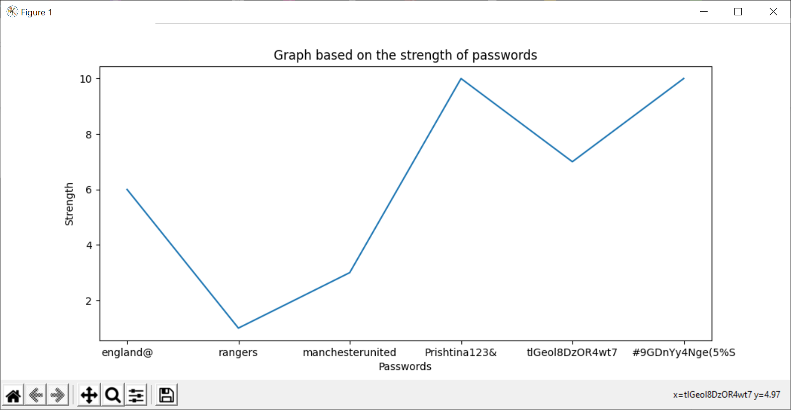
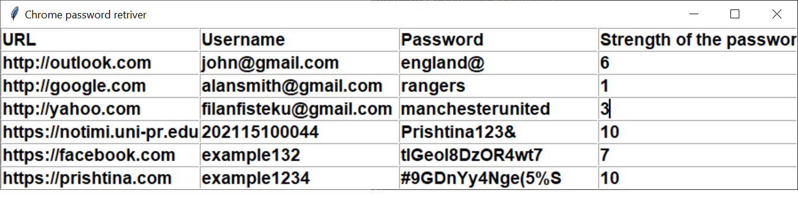

# Internet Security Project
This is a project on retriving passwords from web browsers that are saved there.

## How to use the program
1. Click run main.py.
2. A window opens up and asks you in which browser you would like to retrive your passwords.

3. You select one (for example you select Chrome)
4. Right after that, the graph shows up, with each password and their strength.

5. After that, a table shows up with each url, username, already decrypted password and their strength.

